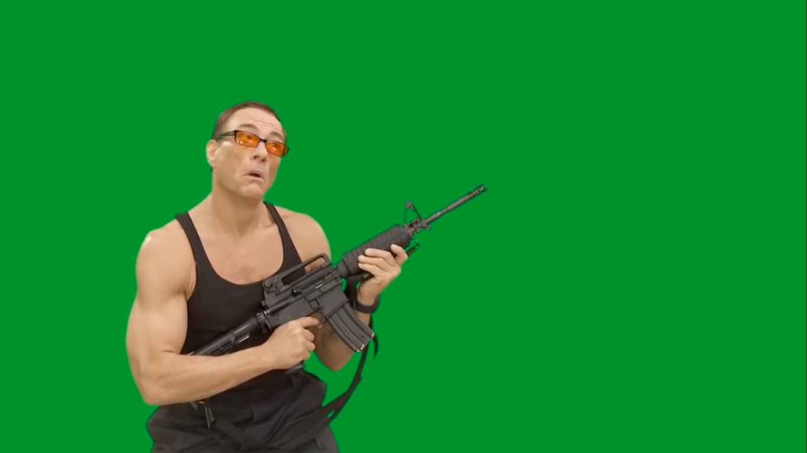
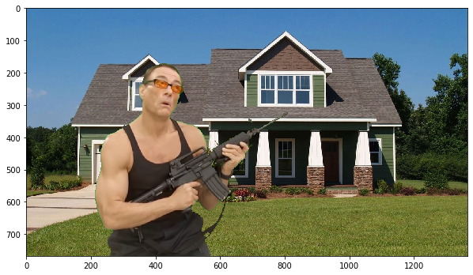

# Background Changer
1. First, you need to read this notebook [image_mask_using_numpy.ipynb](image_mask_using_numpy.ipynb) which has an explanation of how masks in NumPy images (matrices) are manipulated and made.
1. Second, read this notebook [change_greenscreen.ipynb](change_greenscreen.ipynb) which explain how to change the background of an image that has a green screen as a background with any other image.
Example:
The image that we want to change its background

The background image

The new image after changing its background

1. Third, read this notebook [automatic_video_background_changer.ipynb](automatic_video_background_changer.ipynb) that explains how to change the background of a video with a fixed image as a background. In the example explained in the notebook we used this video [Vandamme Video](https://youtu.be/IaQfYosw0XM) and changed its background with this image  to create this new video [new video with its background changed](https://youtu.be/V28qUhj_5ro).
1. Fourth, read this notebook [automatic_video_background_changer_with_video_as_background.ipynb](automatic_video_background_changer_with_video_as_background.ipynb) that explains how to change the background of a video with another video. So basically the new generated video will be a combination of the two videos. In this notebook we used the same [vandamme video](https://youtu.be/IaQfYosw0XM) and used this video as a background [New York Streets](https://youtu.be/vCdBIRtsL6o) and got this new generated video [vandamme background changed with a video](https://youtu.be/WmcLKRxm7kY).
Take a look at this [composed video](https://youtu.be/ICxn9NCc5ZM) that shows all results.
